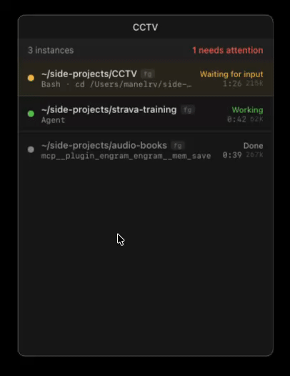

<div align="center">

# CCTV

**Stop alt-tabbing through terminals to find out which Claude Code agent needs you.**

CCTV is a macOS menu-bar app that shows the live state of **every Claude Code instance**
on your machine — working, waiting for your approval, waiting for input, done, or failed —
in one always-on-top floating window. The agent that needs you comes to you.



<sub>`Cmd+Shift+Space` jumps focus straight to the next agent that needs you.</sub>


</div>

---

## Why

Running several Claude Code agents at once means babysitting several terminals — checking
tab after tab to see which one is blocked on a permission prompt or a question. CCTV
collapses that into a single glance: a dynamic tray icon turns to *alert* with a counter,
the blocked agent floats to the top of the list, and a global hotkey takes you straight
to its terminal.

## Install

> **Homebrew tap — coming soon.** A signed + notarized `.dmg` ships from the
> [release pipeline](docs/RELEASING.md) on every tagged release. For now, build
> from source.

### Build from source

```bash
git clone https://github.com/manelrv/CCTV.git
cd CCTV
npm install
npm run tauri build      # produces a .app / .dmg under src-tauri/target/release/bundle
```

Or run it in development:

```bash
npm install
npm run tauri dev
```

**Requirements:** Node.js 18+ and the [Tauri 2 toolchain](https://v2.tauri.app/start/prerequisites/)
(stable Rust + platform deps).

### Connect the hooks (foreground sessions)

Background sessions (`claude --bg`) need no setup. To also see regular foreground
sessions, merge the `hooks` key from
[`hooks/settings.snippet.json`](hooks/settings.snippet.json) into your
`~/.claude/settings.json`. Inside Claude Code, `/hooks` should then list them with
source `User`. From then on every session you open appears in the window.

## Features

- **Hybrid dual-source monitoring** — covers both kinds of sessions:
  - *Background* (`claude --bg`, Agent View): a file watcher reads the `state.json`
    files the Claude Code supervisor persists under `~/.claude/jobs/`. Zero config.
  - *Foreground* (regular `claude` in a terminal): HTTP hooks POST to a local server
    embedded in the app. Endpoints respond instantly and never slow your sessions down.
- **Global hotkey** — `Cmd+Shift+Space` cycles focus through the agents that need you,
  in urgency order, bringing each hosting terminal to the front.
- **Urgency-ordered list** — waiting for permission > waiting for input > error >
  working > no signal > idle > completed. The row that needs you is always on top,
  with the pending question or `approve Tool: path` as detail.
- **Dynamic tray icon** — calm/alert variants plus a numeric attention counter in the
  menu bar.
- **Click to focus or copy** — click a row to jump to its terminal tab; Alt-click (or
  background rows) copies `claude attach <id>` / the working directory instead.
- **Per-session context meter** — shows context-window occupancy per agent, with
  amber/red thresholds, so you see who's about to run out of room.
- **Desktop notifications** — one alert per agent the moment it starts needing you. No spam.
- **Floats above fullscreen apps** — a non-activating `NSPanel`: visible on every Space,
  never steals focus from your active app.
- **All preferences live** — floating window, always on top, auto-hide, compact mode,
  open at login, theme (system/dark/light), opacity, and language.
- **8 languages** — English (default), Spanish, Portuguese, German, French, Italian,
  Catalan, Russian. Auto-detected, or pinned from the tray's **Language** submenu.

## How it works

```
Claude Code — bg sessions            Claude Code — fg sessions
  ~/.claude/jobs/<id>/state.json         HTTP hooks (POST localhost:8787)
        │  file watcher                       │
        ▼                                     ▼
CCTV (always-alive tray process)
  ├── jobs.rs    → source A: watch + parse supervisor state files
  ├── server.rs  → source B: hook receiver (axum)
  ├── state.rs   → hybrid store, "background wins" merge rule, TTL reaper
  ├── refresh.rs → single propagation point: webview, tray icon, auto-hide
  └── webview    → React floating window (event-driven, no polling)
```

Full details in [`CLAUDE.md`](CLAUDE.md), [`docs/DATA-SOURCES.md`](docs/DATA-SOURCES.md)
and [`docs/ARCHITECTURE.md`](docs/ARCHITECTURE.md).

## Development

```bash
npm run tauri dev          # Vite + Rust, opens the app
cd src-tauri && cargo test # Rust test suite (54 tests)
```

## Project status

**Functionally complete on macOS.** Hybrid sources verified against real sessions,
state machine and reaper covered by unit + live-kill tests, dynamic tray with all
preferences live, i18n (auto-detect + manual), global hotkey, and fullscreen float.
54 passing tests.

**Next up:** signed/notarized release + Homebrew tap, then Linux/Wayland (Hyprland
rules drafted in [`docs/ARCHITECTURE.md`](docs/ARCHITECTURE.md)) and Windows.
History in [`WORKLOG.md`](WORKLOG.md), phase tracking in [`docs/ROADMAP.md`](docs/ROADMAP.md).

## Platforms

macOS (primary) → Linux → Windows.
